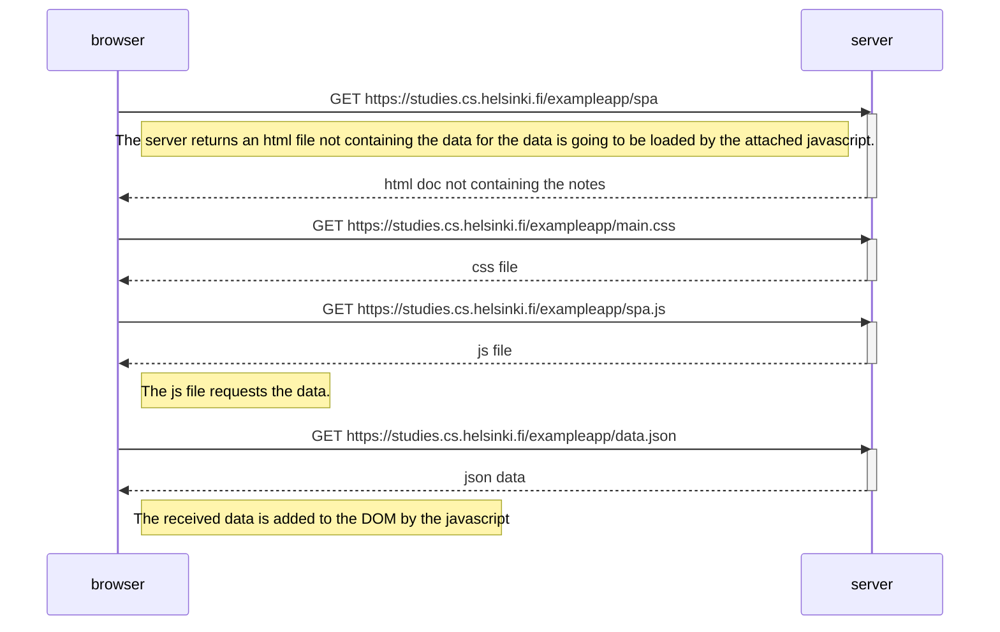

```mermaid
sequenceDiagram
    participant browser
    participant server

    browser->>server: GET https://studies.cs.helsinki.fi/exampleapp/spa
    activate server
    Note left of server: The server returns an html file not containing the data for the data is going to be loaded by the attached javascript.
    server-->>browser: html doc not containing the notes
    deactivate server

    browser->>server: GET https://studies.cs.helsinki.fi/exampleapp/main.css
    activate server
    server-->>browser: css file
    deactivate server

    browser->>server: GET https://studies.cs.helsinki.fi/exampleapp/spa.js
    activate server
    server-->>browser: js file
    deactivate server

    Note right of browser: The js file requests the data. 
    browser->>server: GET https://studies.cs.helsinki.fi/exampleapp/data.json
    activate server
    server-->>browser: json data
    deactivate server

    Note right of browser: The received data is added to the DOM by the javascript

```